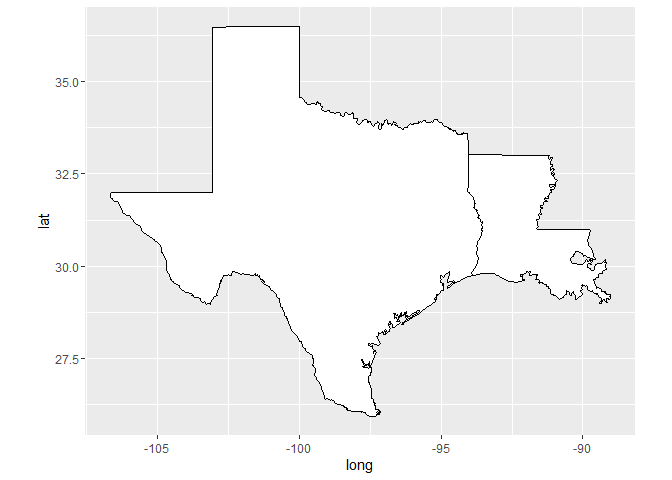
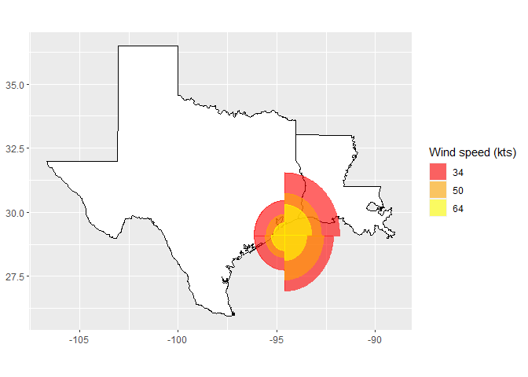

README
================

<!-- README.md is generated from README.Rmd. Please edit that file -->

<!-- badges: start -->

<!-- badges: end -->

The package includes a custom ggplot geom for visualizing directional
wind fields in the four quadrants defined by the cardinal directions
(NE, NW, SW, SE)

## Installation

You can install this package directly from github using the devtools
package:

``` r
library(devtools)
install_github("rsizem2/")
```

## Example

We include a raw dataset which can be used with our new geom. To access
this data, use the `get_hurricane_data` function, which will return the
data in a format that is easily manipulated for visualization purposes.
and subset our hurricane data to a specific observation corresponding to
Hurricane Ike at

``` r
library(hurricane)
library(tidyverse)
library(lubridate)
library(maps)

ike_data <- get_hurricane_data() %>%
    dplyr::filter(startsWith(storm_id, "IKE"),
           datetime %in% lubridate::ymd_hm("2008-09-13 06:00"))
```

We use the `maps` package to load map data for more context for our
visualizations, which will be used as the baseplot on which we’ll add
our new geom as a layer.

``` r

gulf_coast <- map_data("state") %>% subset(region %in% c('texas','louisiana'))

base_map <- ggplot(data = gulf_coast) + 
    geom_polygon(aes(x = long, y = lat, group = group), fill = "palegreen", color = "black") +
    coord_fixed(1.3) 

base_map
```



We can then use our `geom_hurricane` function to add a new layer to this
base plot.

``` r
base_map + geom_hurricane(data = ike_data,
                          aes(x = longitude, y = latitude,
                              r_ne = NE, r_se = SE, r_nw = NW,  r_sw = SW,
                              fill = windspeed, color = windspeed, scale_radii = 0.65)) +
    scale_color_manual(name = "Wind speed (kts)",
                       values = c("red", "orange", "yellow")) +
    scale_fill_manual(name = "Wind speed (kts)",
                      values = c("red", "orange", "yellow")) +
    labs(x = NULL, y = NULL)
```


